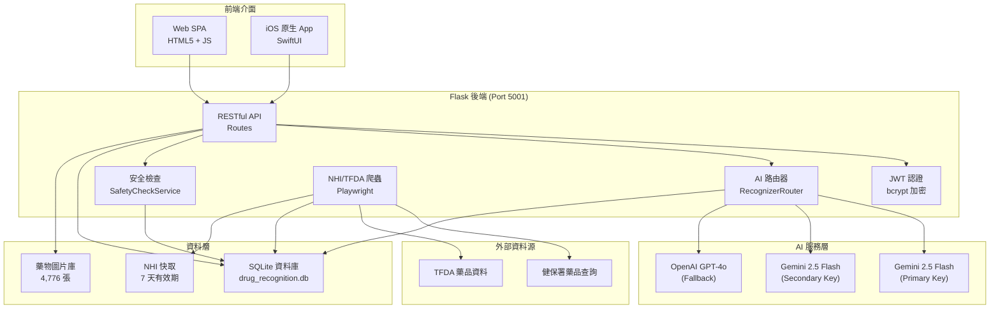

# 圖 1：系統整體架構圖
# 用途：論文 2.3 節（本文構想）& 3.1 節（系統架構總覽）
# 格式：Mermaid — 可用 mermaid.live 或 VS Code Mermaid 插件輸出為 PNG

```mermaid
graph TB
    subgraph Client["前端介面"]
        Web["Web SPA<br/>HTML5 + JS"]
        iOS["iOS 原生 App<br/>SwiftUI"]
    end

    subgraph Backend["Flask 後端 (Port 5001)"]
        API["RESTful API<br/>Routes"]
        Auth["JWT 認證<br/>bcrypt 加密"]
        Router["AI 路由器<br/>RecognizerRouter"]
        Safety["安全檢查<br/>SafetyCheckService"]
        Crawler["NHI/TFDA 爬蟲<br/>Playwright"]
    end

    subgraph AI["AI 服務層"]
        Gemini1["Gemini 2.5 Flash<br/>(Primary Key)"]
        Gemini2["Gemini 2.5 Flash<br/>(Secondary Key)"]
        OpenAI["OpenAI GPT-4o<br/>(Fallback)"]
    end

    subgraph Data["資料層"]
        SQLite["SQLite 資料庫<br/>drug_recognition.db"]
        Images["藥物圖片庫<br/>4,776 張"]
        Cache["NHI 快取<br/>7 天有效期"]
    end

    subgraph External["外部資料源"]
        NHI["健保署藥品查詢"]
        TFDA["TFDA 藥品資料"]
    end

    Web --> API
    iOS --> API
    API --> Auth
    API --> Router
    API --> Safety
    Router --> Gemini1
    Router --> Gemini2
    Router --> OpenAI
    Router --> SQLite
    Safety --> SQLite
    Crawler --> NHI
    Crawler --> TFDA
    Crawler --> SQLite
    Crawler --> Cache
    API --> SQLite
    API --> Images
```
