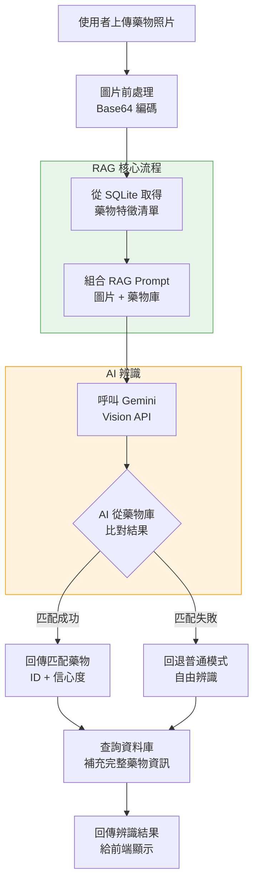

# 圖 2：RAG 檢索增強生成辨識流程圖
# 用途：論文 3.3 節
# 格式：Mermaid

```mermaid
flowchart TD
    A["使用者上傳藥物照片"] --> B["圖片前處理<br/>Base64 編碼"]
    B --> C["從 SQLite 取得<br/>藥物特徵清單"]
    C --> D["組合 RAG Prompt<br/>圖片 + 藥物庫"]
    D --> E["呼叫 Gemini<br/>Vision API"]
    E --> F{"AI 從藥物庫<br/>比對結果"}
    F -->|"匹配成功"| G["回傳匹配藥物<br/>ID + 信心度"]
    F -->|"匹配失敗"| H["回退普通模式<br/>自由辨識"]
    G --> I["查詢資料庫<br/>補充完整藥物資訊"]
    H --> I
    I --> J["回傳辨識結果<br/>給前端顯示"]

    subgraph RAG["RAG 核心流程"]
        C
        D
    end

    subgraph AI["AI 辨識"]
        E
        F
    end

    style RAG fill:#e8f5e9,stroke:#4caf50
    style AI fill:#fff3e0,stroke:#ff9800
```
