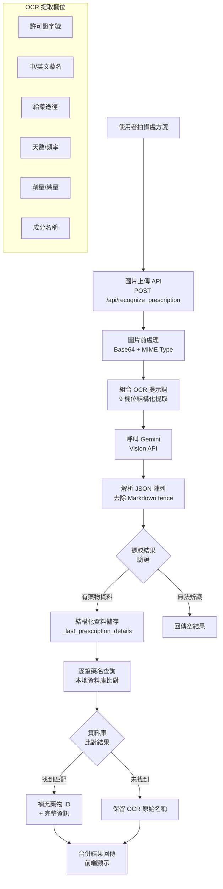

# 圖 3：處方箋 OCR 辨識流程圖
# 用途：論文 3.4 節
# 格式：Mermaid

```mermaid
flowchart TD
    A["使用者拍攝處方箋"] --> B["圖片上傳 API<br/>POST /api/recognize_prescription"]
    B --> C["圖片前處理<br/>Base64 + MIME Type"]
    C --> D["組合 OCR 提示詞<br/>9 欄位結構化提取"]
    D --> E["呼叫 Gemini<br/>Vision API"]
    E --> F["解析 JSON 陣列<br/>去除 Markdown fence"]
    F --> G{"提取結果<br/>驗證"}
    G -->|"有藥物資料"| H["結構化資料儲存<br/>_last_prescription_details"]
    G -->|"無法辨識"| I["回傳空結果"]
    H --> J["逐筆藥名查詢<br/>本地資料庫比對"]
    J --> K{"資料庫<br/>比對結果"}
    K -->|"找到匹配"| L["補充藥物 ID<br/>+ 完整資訊"]
    K -->|"未找到"| M["保留 OCR 原始名稱"]
    L --> N["合併結果回傳<br/>前端顯示"]
    M --> N

    subgraph OCR["OCR 提取欄位"]
        direction LR
        F1["許可證字號"]
        F2["中/英文藥名"]
        F3["給藥途徑"]
        F4["天數/頻率"]
        F5["劑量/總量"]
        F6["成分名稱"]
    end
```
