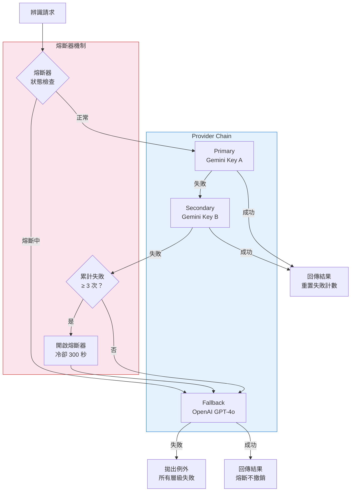

# 圖 4：多層 AI Provider 路由架構圖
# 用途：論文 3.5 節
# 格式：Mermaid

```mermaid
flowchart TD
    REQ["辨識請求"] --> CHECK{"熔斷器<br/>狀態檢查"}
    
    CHECK -->|"正常"| P["Primary<br/>Gemini Key A"]
    CHECK -->|"熔斷中"| FB["Fallback<br/>OpenAI GPT-4o"]
    
    P -->|"成功"| SUCC["回傳結果<br/>重置失敗計數"]
    P -->|"失敗"| S["Secondary<br/>Gemini Key B"]
    
    S -->|"成功"| SUCC
    S -->|"失敗"| COUNT{"累計失敗<br/>≥ 3 次？"}
    
    COUNT -->|"否"| FB
    COUNT -->|"是"| BREAKER["開啟熔斷器<br/>冷卻 300 秒"]
    BREAKER --> FB
    
    FB -->|"成功"| SUCC2["回傳結果<br/>熔斷不撤銷"]
    FB -->|"失敗"| ERR["拋出例外<br/>所有層級失敗"]

    subgraph Chain["Provider Chain"]
        P
        S
        FB
    end

    subgraph Circuit["熔斷器機制"]
        CHECK
        COUNT
        BREAKER
    end

    style Chain fill:#e3f2fd,stroke:#1976d2
    style Circuit fill:#fce4ec,stroke:#c62828
```
