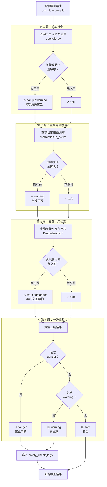

# 圖 5：四層安全檢查流程圖
# 用途：論文 3.6 節
# 格式：Mermaid

```mermaid
flowchart TD
    START["新增藥物請求<br/>user_id + drug_id"] --> L1

    subgraph Layer1["第 1 層：過敏檢查"]
        L1["查詢用戶過敏原清單<br/>UserAllergy"] --> L1C{"藥物成分 ∩<br/>過敏原？"}
        L1C -->|"有交集"| L1D["⚠ danger/warning<br/>標記過敏成分"]
        L1C -->|"無交集"| L1S["✓ safe"]
    end

    L1D --> L2
    L1S --> L2

    subgraph Layer2["第 2 層：重複用藥檢查"]
        L2["查詢目前用藥清單<br/>Medication.is_active"] --> L2C{"同藥物 ID<br/>或同名？"}
        L2C -->|"已存在"| L2D["⚠ warning<br/>重複用藥"]
        L2C -->|"不重複"| L2S["✓ safe"]
    end

    L2D --> L3
    L2S --> L3

    subgraph Layer3["第 3 層：交互作用檢查"]
        L3["查詢藥物交互作用表<br/>DrugInteraction"] --> L3C{"與現有用藥<br/>有交互？"}
        L3C -->|"有交互"| L3D["⚠ warning/danger<br/>標記交互藥物"]
        L3C -->|"無交互"| L3S["✓ safe"]
    end

    L3D --> L4
    L3S --> L4

    subgraph Layer4["第 4 層：分級彙整"]
        L4["彙整三層結果"] --> L4C{"包含<br/>danger？"}
        L4C -->|"是"| DANGER["🔴 danger<br/>禁止用藥"]
        L4C -->|"否"| L4W{"包含<br/>warning？"}
        L4W -->|"是"| WARN["🟡 warning<br/>需注意"]
        L4W -->|"否"| SAFE["🟢 safe<br/>安全"]
    end

    DANGER --> LOG["寫入 safety_check_logs"]
    WARN --> LOG
    SAFE --> DONE["回傳檢查結果"]
    LOG --> DONE
```
