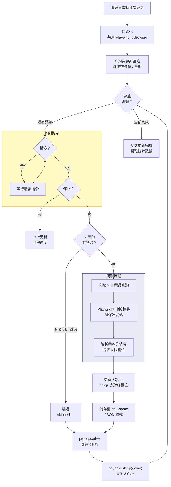

# 圖 6：NHI/TFDA 爬蟲批次更新流程圖
# 用途：論文 3.7 節
# 格式：Mermaid

```mermaid
flowchart TD
    START["管理員啟動批次更新"] --> INIT["初始化<br/>共用 Playwright Browser"]
    INIT --> QUERY["查詢待更新藥物<br/>篩選空欄位 / 全部"]
    QUERY --> LOOP{"逐筆<br/>處理？"}
    
    LOOP -->|"還有藥物"| PAUSE{"暫停？"}
    PAUSE -->|"是"| WAIT["等待繼續指令"]
    WAIT --> PAUSE
    PAUSE -->|"否"| STOP{"停止？"}
    STOP -->|"是"| END_STOP["中止更新<br/>回報進度"]
    STOP -->|"否"| CACHE{"7 天內<br/>有快取？"}
    
    CACHE -->|"有 & 啟用跳過"| SKIP["跳過<br/>skipped++"]
    CACHE -->|"無"| CRAWL["爬取 NHI 藥品查詢"]
    
    CRAWL --> NHI["Playwright 模擬搜尋<br/>健保署網站"]
    NHI --> PARSE["解析藥物詳情頁<br/>提取 6 個欄位"]
    PARSE --> UPDATE["更新 SQLite<br/>drugs 表對應欄位"]
    UPDATE --> SAVE_CACHE["儲存至 nhi_cache<br/>JSON 格式"]
    
    SKIP --> NEXT["processed++<br/>等待 delay"]
    SAVE_CACHE --> NEXT
    NEXT --> DELAY["asyncio.sleep(delay)<br/>0.3~3.0 秒"]
    DELAY --> LOOP
    
    LOOP -->|"全部完成"| DONE["批次更新完成<br/>回報統計數據"]

    subgraph Control["控制機制"]
        PAUSE
        STOP
        WAIT
    end

    subgraph Crawl["爬取流程"]
        CRAWL
        NHI
        PARSE
    end

    style Control fill:#fff9c4,stroke:#f9a825
    style Crawl fill:#e8eaf6,stroke:#3f51b5
```
