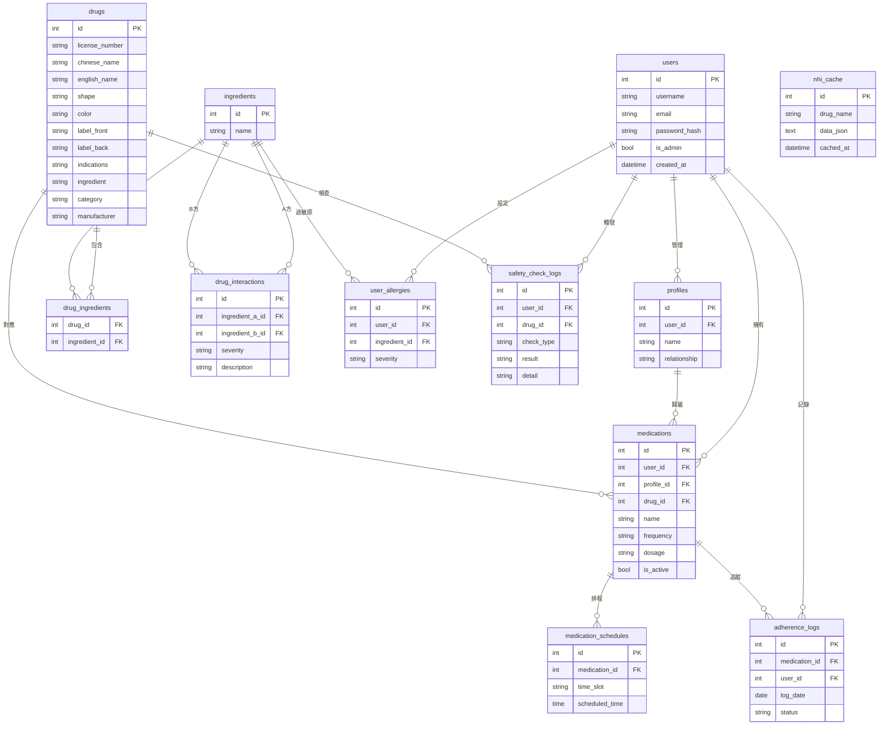

# 圖 7：資料庫 ER 圖
# 用途：論文 3.8 節
# 格式：Mermaid erDiagram

```mermaid
erDiagram
    users {
        int id PK
        string username
        string email
        string password_hash
        bool is_admin
        datetime created_at
    }
    
    drugs {
        int id PK
        string license_number
        string chinese_name
        string english_name
        string shape
        string color
        string label_front
        string label_back
        string indications
        string ingredient
        string category
        string manufacturer
    }
    
    profiles {
        int id PK
        int user_id FK
        string name
        string relationship
    }
    
    medications {
        int id PK
        int user_id FK
        int profile_id FK
        int drug_id FK
        string name
        string frequency
        string dosage
        bool is_active
    }
    
    medication_schedules {
        int id PK
        int medication_id FK
        string time_slot
        time scheduled_time
    }
    
    adherence_logs {
        int id PK
        int medication_id FK
        int user_id FK
        date log_date
        string status
    }
    
    ingredients {
        int id PK
        string name
    }
    
    drug_ingredients {
        int drug_id FK
        int ingredient_id FK
    }
    
    drug_interactions {
        int id PK
        int ingredient_a_id FK
        int ingredient_b_id FK
        string severity
        string description
    }
    
    user_allergies {
        int id PK
        int user_id FK
        int ingredient_id FK
        string severity
    }
    
    safety_check_logs {
        int id PK
        int user_id FK
        int drug_id FK
        string check_type
        string result
        string detail
    }
    
    nhi_cache {
        int id PK
        string drug_name
        text data_json
        datetime cached_at
    }

    users ||--o{ profiles : "管理"
    users ||--o{ medications : "擁有"
    users ||--o{ user_allergies : "設定"
    users ||--o{ adherence_logs : "記錄"
    users ||--o{ safety_check_logs : "觸發"
    profiles ||--o{ medications : "歸屬"
    drugs ||--o{ medications : "對應"
    drugs ||--o{ drug_ingredients : "包含"
    drugs ||--o{ safety_check_logs : "檢查"
    ingredients ||--o{ drug_ingredients : "屬於"
    ingredients ||--o{ drug_interactions : "A方"
    ingredients ||--o{ drug_interactions : "B方"
    ingredients ||--o{ user_allergies : "過敏原"
    medications ||--o{ medication_schedules : "排程"
    medications ||--o{ adherence_logs : "追蹤"
```
