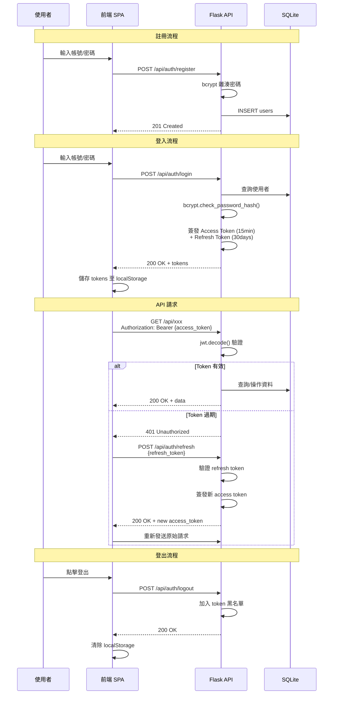

# 圖 8：JWT 認證流程圖
# 用途：論文 3.9 節
# 格式：Mermaid sequence diagram

```mermaid
sequenceDiagram
    participant U as 使用者
    participant F as 前端 SPA
    participant A as Flask API
    participant DB as SQLite

    Note over U,DB: 註冊流程
    U->>F: 輸入帳號/密碼
    F->>A: POST /api/auth/register
    A->>A: bcrypt 雜湊密碼
    A->>DB: INSERT users
    A-->>F: 201 Created

    Note over U,DB: 登入流程
    U->>F: 輸入帳號/密碼
    F->>A: POST /api/auth/login
    A->>DB: 查詢使用者
    A->>A: bcrypt.check_password_hash()
    A->>A: 簽發 Access Token (15min)<br/>+ Refresh Token (30days)
    A-->>F: 200 OK + tokens
    F->>F: 儲存 tokens 至 localStorage

    Note over U,DB: API 請求
    F->>A: GET /api/xxx<br/>Authorization: Bearer {access_token}
    A->>A: jwt.decode() 驗證
    alt Token 有效
        A->>DB: 查詢/操作資料
        A-->>F: 200 OK + data
    else Token 過期
        A-->>F: 401 Unauthorized
        F->>A: POST /api/auth/refresh<br/>{refresh_token}
        A->>A: 驗證 refresh token
        A->>A: 簽發新 access token
        A-->>F: 200 OK + new access_token
        F->>A: 重新發送原始請求
    end

    Note over U,DB: 登出流程
    U->>F: 點擊登出
    F->>A: POST /api/auth/logout
    A->>A: 加入 token 黑名單
    A-->>F: 200 OK
    F->>F: 清除 localStorage
```
