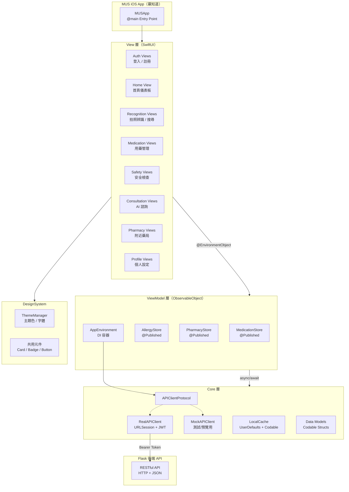

# 圖 9：iOS 原生 App 架構圖
# 用途：論文 3.10 節（iOS 原生 App 架構設計）
# 格式：Mermaid — 可用 mermaid.live 或 VS Code Mermaid 插件輸出為 PNG

```mermaid
graph TB
    subgraph App["MUS iOS App（藥知道）"]
        direction TB
        MUSApp["MUSApp<br/>@main Entry Point"]
    end

    subgraph Views["View 層（SwiftUI）"]
        direction LR
        AuthV["Auth Views<br/>登入 / 註冊"]
        HomeV["Home View<br/>首頁儀表板"]
        RecogV["Recognition Views<br/>拍照辨識 / 搜尋"]
        MedV["Medication Views<br/>用藥管理"]
        SafeV["Safety Views<br/>安全檢查"]
        ConsultV["Consultation Views<br/>AI 諮詢"]
        PharmV["Pharmacy Views<br/>附近藥局"]
        ProfileV["Profile Views<br/>個人設定"]
    end

    subgraph ViewModels["ViewModel 層（ObservableObject）"]
        direction LR
        MedStore["MedicationStore<br/>@Published"]
        AllergyStore["AllergyStore<br/>@Published"]
        PharmStore["PharmacyStore<br/>@Published"]
        AppEnv["AppEnvironment<br/>DI 容器"]
    end

    subgraph Core["Core 層"]
        direction LR
        APIProto["APIClientProtocol"]
        RealAPI["RealAPIClient<br/>URLSession + JWT"]
        MockAPI["MockAPIClient<br/>測試/預覽用"]
        LocalCache["LocalCache<br/>UserDefaults + Codable"]
        Models["Data Models<br/>Codable Structs"]
    end

    subgraph DesignSystem["DesignSystem"]
        direction LR
        Theme["ThemeManager<br/>主題色 / 字體"]
        Components["共用元件<br/>Card / Badge / Button"]
    end

    MUSApp --> Views
    Views -->|"@EnvironmentObject"| ViewModels
    ViewModels -->|"async/await"| Core
    Views --> DesignSystem
    APIProto -.-> RealAPI
    APIProto -.-> MockAPI
    AppEnv --> APIProto

    subgraph Backend["Flask 後端 API"]
        FlaskAPI["RESTful API<br/>HTTP + JSON"]
    end

    RealAPI -->|"Bearer Token"| FlaskAPI
```
