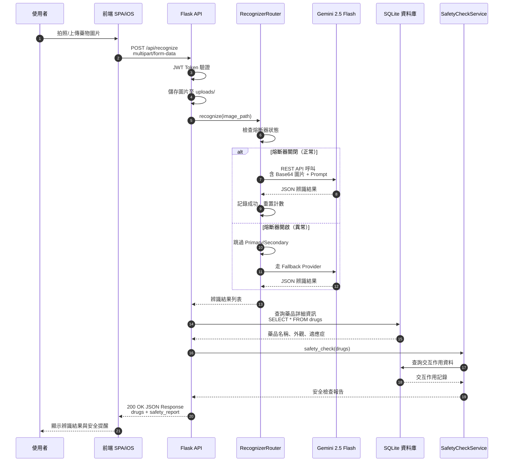

# 圖 10：藥物辨識互動時序圖
# 用途：論文 3.3 節（RAG 辨識流程）— 展示完整 API 請求生命週期
# 格式：Mermaid sequenceDiagram

```mermaid
sequenceDiagram
    autonumber
    participant U as 使用者
    participant F as 前端 SPA/iOS
    participant A as Flask API
    participant R as RecognizerRouter
    participant G as Gemini 2.5 Flash
    participant DB as SQLite 資料庫
    participant S as SafetyCheckService

    U->>F: 拍照/上傳藥物圖片
    F->>A: POST /api/recognize<br/>multipart/form-data
    A->>A: JWT Token 驗證
    A->>A: 儲存圖片至 uploads/

    A->>R: recognize(image_path)
    R->>R: 檢查熔斷器狀態

    alt 熔斷器關閉（正常）
        R->>G: REST API 呼叫<br/>含 Base64 圖片 + Prompt
        G-->>R: JSON 辨識結果
        R->>R: 記錄成功，重置計數
    else 熔斷器開啟（異常）
        R->>R: 跳過 Primary/Secondary
        R->>G: 走 Fallback Provider
        G-->>R: JSON 辨識結果
    end

    R-->>A: 辨識結果列表

    A->>DB: 查詢藥品詳細資訊<br/>SELECT * FROM drugs
    DB-->>A: 藥品名稱、外觀、適應症

    A->>S: safety_check(drugs)
    S->>DB: 查詢交互作用資料
    DB-->>S: 交互作用記錄
    S-->>A: 安全檢查報告

    A-->>F: 200 OK JSON Response<br/>drugs + safety_report
    F-->>U: 顯示辨識結果與安全提醒
```
