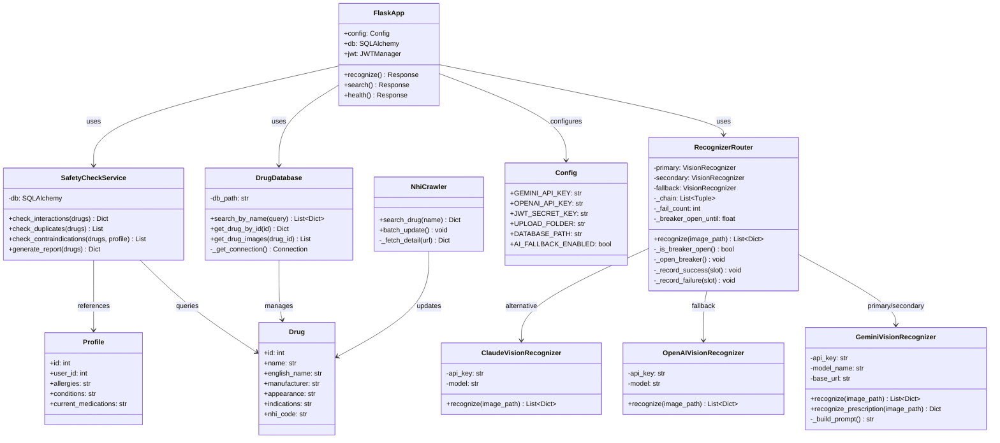

# 圖 11：系統核心類別圖
# 用途：論文 3.2 節（系統設計）— 展示主要模組與類別關係
# 格式：Mermaid classDiagram

```mermaid
classDiagram
    direction TB

    class FlaskApp {
        +config: Config
        +db: SQLAlchemy
        +jwt: JWTManager
        +recognize() Response
        +search() Response
        +health() Response
    }

    class RecognizerRouter {
        -primary: VisionRecognizer
        -secondary: VisionRecognizer
        -fallback: VisionRecognizer
        -_chain: List~Tuple~
        -_fail_count: int
        -_breaker_open_until: float
        +recognize(image_path) List~Dict~
        -_is_breaker_open() bool
        -_open_breaker() void
        -_record_success(slot) void
        -_record_failure(slot) void
    }

    class GeminiVisionRecognizer {
        -api_key: str
        -model_name: str
        -base_url: str
        +recognize(image_path) List~Dict~
        +recognize_prescription(image_path) Dict
        -_build_prompt() str
    }

    class ClaudeVisionRecognizer {
        -api_key: str
        -model: str
        +recognize(image_path) List~Dict~
    }

    class OpenAIVisionRecognizer {
        -api_key: str
        -model: str
        +recognize(image_path) List~Dict~
    }

    class SafetyCheckService {
        -db: SQLAlchemy
        +check_interactions(drugs) Dict
        +check_duplicates(drugs) List
        +check_contraindications(drugs, profile) List
        +generate_report(drugs) Dict
    }

    class DrugDatabase {
        -db_path: str
        +search_by_name(query) List~Dict~
        +get_drug_by_id(id) Dict
        +get_drug_images(drug_id) List
        -_get_connection() Connection
    }

    class Drug {
        +id: int
        +name: str
        +english_name: str
        +manufacturer: str
        +appearance: str
        +indications: str
        +nhi_code: str
    }

    class Profile {
        +id: int
        +user_id: int
        +allergies: str
        +conditions: str
        +current_medications: str
    }

    class Config {
        +GEMINI_API_KEY: str
        +OPENAI_API_KEY: str
        +JWT_SECRET_KEY: str
        +UPLOAD_FOLDER: str
        +DATABASE_PATH: str
        +AI_FALLBACK_ENABLED: bool
    }

    class NhiCrawler {
        +search_drug(name) Dict
        +batch_update() void
        -_fetch_detail(url) Dict
    }

    FlaskApp --> RecognizerRouter : uses
    FlaskApp --> SafetyCheckService : uses
    FlaskApp --> DrugDatabase : uses
    FlaskApp --> Config : configures

    RecognizerRouter --> GeminiVisionRecognizer : primary/secondary
    RecognizerRouter --> OpenAIVisionRecognizer : fallback
    RecognizerRouter --> ClaudeVisionRecognizer : alternative

    SafetyCheckService --> Drug : queries
    SafetyCheckService --> Profile : references
    DrugDatabase --> Drug : manages

    NhiCrawler --> Drug : updates
```
