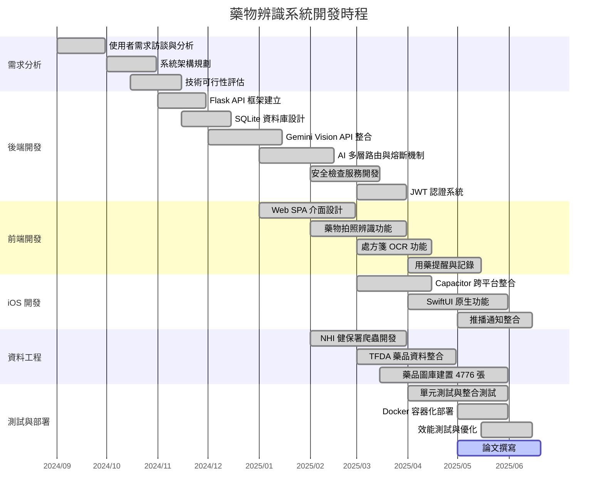

# 圖 12：專案開發時程甘特圖
# 用途：論文 2.2 節（研究方法）— 展示專案開發各階段時程
# 格式：Mermaid gantt

```mermaid
gantt
    title 藥物辨識系統開發時程
    dateFormat YYYY-MM-DD
    axisFormat %Y/%m

    section 需求分析
        使用者需求訪談與分析       :done, req1, 2024-09-01, 2024-09-30
        系統架構規劃               :done, req2, 2024-10-01, 2024-10-31
        技術可行性評估             :done, req3, 2024-10-15, 2024-11-15

    section 後端開發
        Flask API 框架建立         :done, be1, 2024-11-01, 2024-11-30
        SQLite 資料庫設計          :done, be2, 2024-11-15, 2024-12-15
        Gemini Vision API 整合    :done, be3, 2024-12-01, 2025-01-15
        AI 多層路由與熔斷機制      :done, be4, 2025-01-01, 2025-02-15
        安全檢查服務開發           :done, be5, 2025-02-01, 2025-03-15
        JWT 認證系統               :done, be6, 2025-03-01, 2025-03-31

    section 前端開發
        Web SPA 介面設計           :done, fe1, 2025-01-01, 2025-02-28
        藥物拍照辨識功能           :done, fe2, 2025-02-01, 2025-03-31
        處方箋 OCR 功能            :done, fe3, 2025-03-01, 2025-04-15
        用藥提醒與記錄             :done, fe4, 2025-04-01, 2025-05-15

    section iOS 開發
        Capacitor 跨平台整合       :done, ios1, 2025-03-01, 2025-04-15
        SwiftUI 原生功能           :done, ios2, 2025-04-01, 2025-05-31
        推播通知整合               :done, ios3, 2025-05-01, 2025-06-15

    section 資料工程
        NHI 健保署爬蟲開發         :done, data1, 2025-02-01, 2025-03-31
        TFDA 藥品資料整合          :done, data2, 2025-03-01, 2025-04-30
        藥品圖庫建置 4776 張       :done, data3, 2025-03-15, 2025-05-31

    section 測試與部署
        單元測試與整合測試         :done, test1, 2025-04-01, 2025-05-31
        Docker 容器化部署          :done, test2, 2025-05-01, 2025-05-31
        效能測試與優化             :done, test3, 2025-05-15, 2025-06-15
        論文撰寫                   :active, doc1, 2025-05-01, 2025-06-20
```
