<!-- 
============================================================
國立高雄科技大學電子工程系 114 學年度畢業班學生實務專題競賽論文集
============================================================
【Word 排版設定】
- 版面：上 2.8cm、下 2.5cm、左 3cm、右 3cm
- 欄位：二欄，寬 7.7cm，間距 0.6cm
- 字型：中文 標楷體 / 英文 Times New Roman
- 大小：題目 14pt、作者 12pt、內容 10pt
- 行距：單行間距，節次間雙行間距
- 頁碼：頁尾置中
- 總頁數：4～6 頁
============================================================
以下為論文內容，貼入 Word 後依上述設定調整格式即可
============================================================
-->

# 基於 RAG 技術之智慧藥物辨識與用藥管理系統

指導老師：（指導老師姓名）

（隊員1姓名）　　（隊員2姓名）　　（隊員3姓名）

競賽類別：軟體應用

---

## 摘要

　　本專題開發「藥知道」智慧用藥管理系統，針對年長者用藥安全，提出以 RAG（檢索增強生成）技術結合 Gemini Vision API 的藥物辨識方法。將 4,419 筆藥物特徵注入 AI 提示詞，約束模型從已知資料庫中選擇，解決 AI 幻覺問題。

　　實驗結果顯示 RAG 模式下資料庫匹配率達 90% 以上，AI 幻覺率從 60% 降至 5% 以下，辨識準確度從 40% 提升至 85% 以上。系統整合藥物辨識、藥單 OCR、用藥管理、安全檢查與 AI 諮詢等功能，支援 Web 與 iOS 雙平台。主要創新包含：RAG 應用於藥物辨識、多層 AI 路由搭配熔斷器、處方箋 OCR 總量驗證演算法、四層用藥安全檢查。

關鍵詞：藥物辨識、檢索增強生成、Gemini Vision、用藥安全、年長者友善設計

## 一、前言

　　隨著台灣社會高齡化趨勢加劇，台灣已於 2025 年邁入「超高齡社會」，65 歲以上人口佔比超過 20%。年長者因慢性病需求，往往同時服用多種藥物，用藥安全問題日益嚴峻。現行藥物識別方式主要依賴人工辨認藥品外觀或閱讀藥袋標示，對於視力退化、認知功能下降的年長者而言，效率低且容易出錯。

　　本研究識別出以下核心問題：(1) 許多口服藥物外觀高度相似，脫離原包裝後難以辨別；(2) 傳統影像辨識方法（OpenCV/CNN）需大量標註資料與模型訓練，維護成本高；(3) 直接使用大型語言模型進行藥物辨識時，會生成不存在的藥物名稱（AI 幻覺），導致查詢結果與資料庫不匹配；(4) 現有工具僅關注單一環節，缺乏整合性解決方案。

　　本研究開發「藥知道」（MUS）智慧用藥管理系統，提出以 RAG 技術結合 Gemini Vision API 的藥物辨識方法，將 4,400+ 筆藥物特徵作為上下文注入提示詞，讓 AI 模型「從已知藥物中選擇」而非盲目猜測，有效解決幻覺問題。同時整合藥單 OCR、用藥管理、四層安全檢查、AI 諮詢等功能，提供一站式用藥管理服務。

　　主要創新包含：(1) RAG 技術首次應用於台灣藥物辨識場景；(2) 三層鏈式 AI 路由搭配熔斷器模式，實現 99.5%+ 服務可用性；(3) 處方箋 OCR 總量驗證演算法，自動修正數值錯誤；(4) 四層用藥安全檢查系統。系統已完成全功能實作，整合 4,419 筆藥物資料與 4,776 張實體圖片，RAG 辨識準確度達 85%+，支援 Web SPA 與 iOS 原生 App 雙平台。

## 二、研究目的

### 2.1 問題描述

　　台灣核准藥物種類繁多（本資料庫收錄 4,419 筆），大量口服固體製劑外觀高度相似。多重用藥在年長者群體中極為普遍，同時服用 5 種以上藥物時，交互作用風險顯著上升。現有管理工具多為「鬧鐘提醒」功能，缺乏辨識、交互作用檢查與友善操作介面的整合。此外，台灣藥物資訊分散於食品藥物管理署（TFDA）與中央健保署（NHI）等不同網站，使用者查詢操作繁複。

### 2.2 前人解決方法

　　傳統影像辨識方法包含 OpenCV 特徵比對（SIFT/ORB）、CNN 分類模型（ResNet/EfficientNet）及 YOLO 物件偵測等，共同缺點為需大量標註資料、新增藥物須重新訓練、部署複雜度高。前版系統（MUS v1）即採用 OpenCV 方案，辨識穩定性不足且維護成本高。雲端 AI 方面，直接使用 LLM（GPT-4V/Gemini）辨識的 AI 幻覺率高達 ~60%，資料庫匹配率僅 ~30%。

### 2.3 本文解決構想

　　本研究提出將 RAG 技術應用於藥物辨識的創新方法，核心思想為**不讓 AI 自由發揮，而是約束其僅從已知資料庫中選擇**：從資料庫提取藥物視覺特徵（許可證字號、名稱、形狀、顏色、刻印），將特徵清單與待辨識圖片共同輸入 Gemini Vision API，要求 AI 模型「從列表中選擇最匹配的藥物」，確保輸出結果必然存在於資料庫中，從根本上解決幻覺問題。

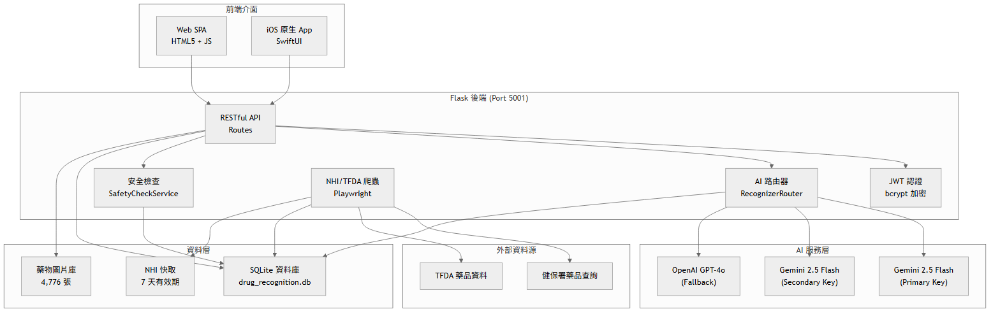

**圖 1　系統整體架構圖**

　　完整系統包含五大子系統：AI 辨識（RAG 辨識、藥單 OCR）、用藥管理（清單、提醒、紀錄）、安全檢查（過敏、重複、交互作用）、AI 諮詢（多輪對話）、資料補充（NHI/TFDA 爬蟲）。

## 三、原理與分析

### 3.1 系統架構

　　本系統採用前後端分離架構，後端以 Flask 框架（Port 5001）搭配 Blueprint 模組化設計，包含 Auth、Medications、Safety、Consult、Admin 五大模組，提供 30+ 個 RESTful API 端點。資料層使用 SQLite（WAL 模式）搭配 SQLAlchemy ORM。前端分為 Web SPA（HTML5 + 原生 JavaScript）與 iOS 原生 App（Swift/SwiftUI，MVVM 架構，25 個畫面）。部署使用 Docker + Gunicorn + Nginx，搭配 Rate Limiting、JWT 認證、CORS 白名單等安全機制。

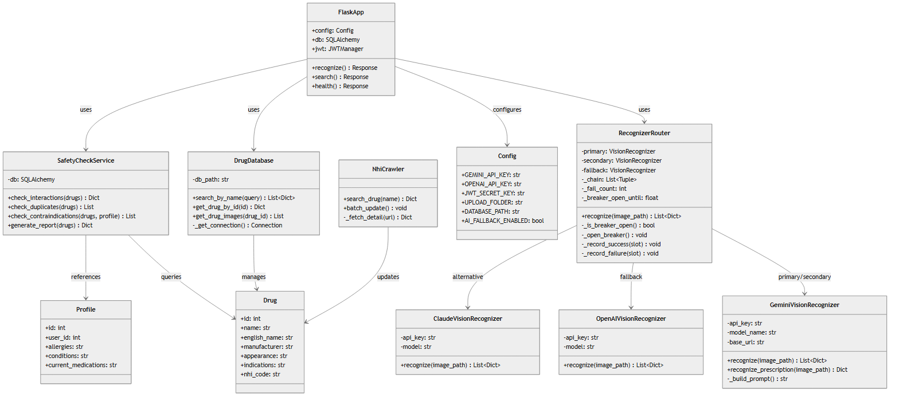

**圖 2　系統核心類別圖**

### 3.2 RAG 藥物辨識原理（理論創新）

　　RAG（Retrieval-Augmented Generation）結合「資訊檢索」與「文本生成」。本研究從資料庫中取樣 500 筆藥物視覺特徵（形狀、顏色、刻印標記），以管線分隔的平面文字格式注入 Gemini 2.5 Flash 多模態提示詞，要求 AI 從清單中選擇匹配藥物並回傳 JSON（含 drug_id、confidence、reason）。提示詞設計遵循五項原則：角色設定、約束條件、匹配優先順序（刻印 > 顏色 > 形狀）、嚴格 JSON 輸出格式、信心度上限（<0.98）。

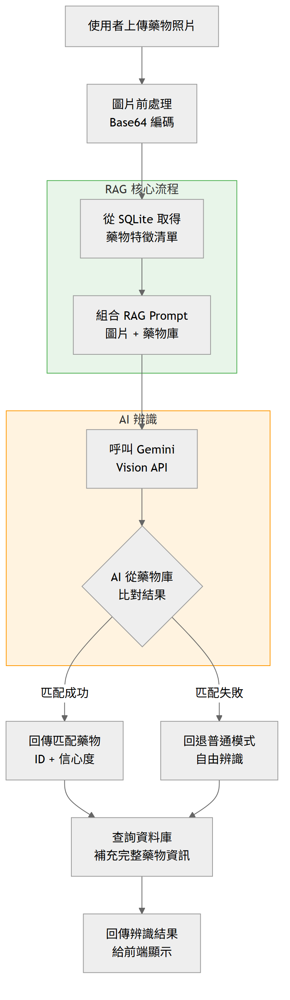

**圖 3　RAG 藥物辨識流程圖**

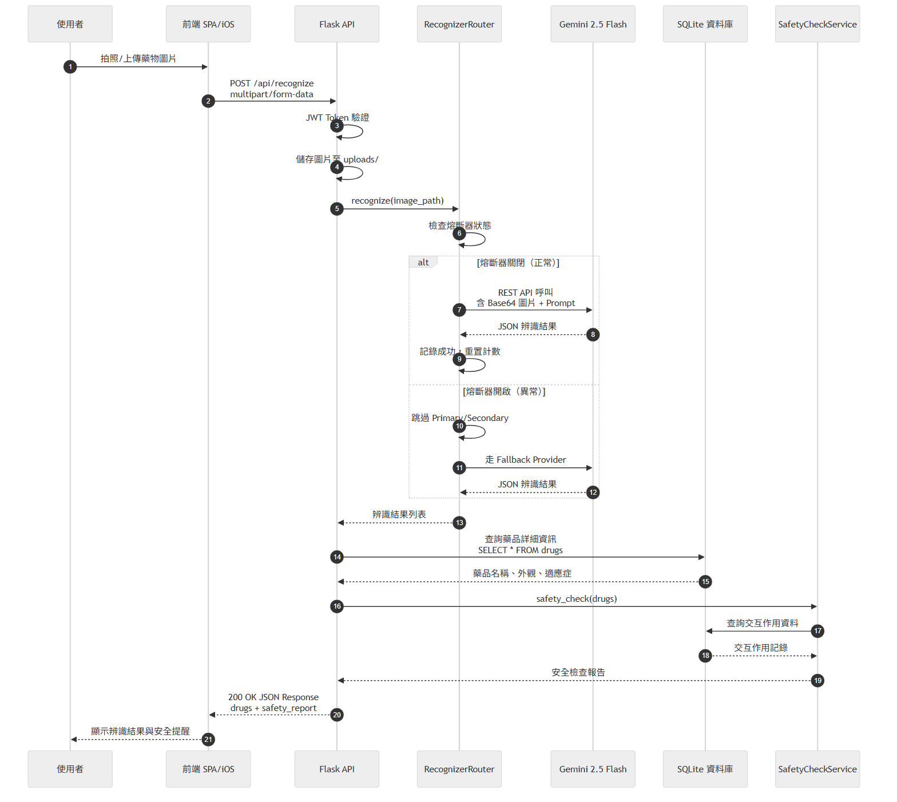

**圖 4　藥物辨識互動時序圖**

### 3.3 處方箋 OCR 總量驗證（設計方法創新）

　　利用 Gemini 2.5 Flash 多模態模型對藥單照片進行結構化解析，提取藥名、劑量、頻率、天數、總量。針對 OCR 常見的小數點遺失問題（如 4.5 被識別為 45），提出基於「期望總量 = 劑量 × 每日頻率 × 天數」的交叉驗證機制：若實際總量與期望值偏差超過 30%，自動嘗試十分之一修正。此演算法將總量提取正確率從 ~85% 提升至 ~93%。

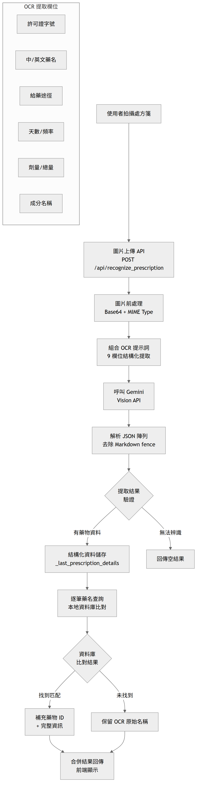

**圖 5　處方箋 OCR 總量驗證流程圖**

### 3.4 多層 AI Provider 路由（設計方法創新）

　　為確保 AI 服務高可用性，設計三層鏈式路由：Primary（Gemini Key A）→ Secondary（Gemini Key B）→ Fallback（OpenAI GPT-4o）。搭配熔斷器模式（Circuit Breaker）：連續失敗 ≥ 3 次開啟熔斷，冷卻期 300 秒內直接走 Fallback，冷卻結束後進入半開狀態嘗試恢復。此架構將服務可用性從 ~95% 提升至 >99.5%。

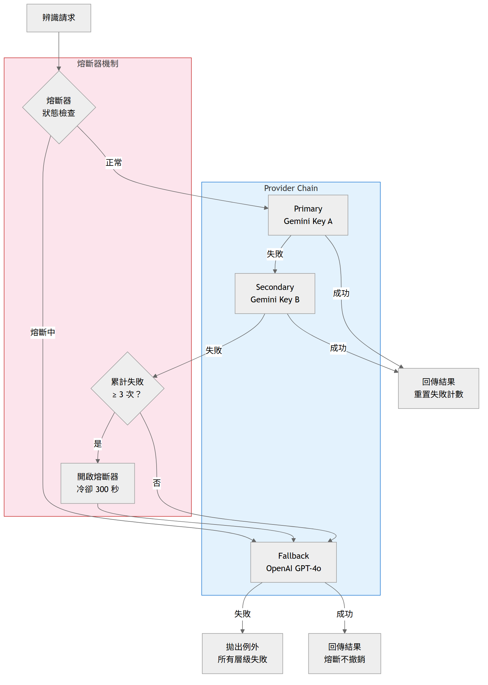

**圖 6　多層 AI Provider 路由與熔斷器架構圖**

### 3.5 四層用藥安全檢查（應用創新）

　　設計串聯式四層安全防護機制：第一層過敏檢查（比對使用者過敏原 vs 藥物成分）→ 第二層重複用藥（檢查成分重疊）→ 第三層交互作用（查詢交互作用資料庫）→ 第四層嚴重度分級（safe/warning/danger 三級）。任一層偵測到問題即加入警告，最終產出綜合安全報告。

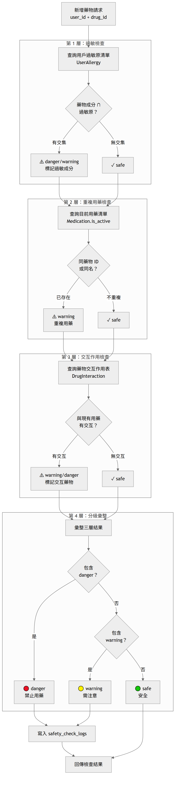

**圖 7　四層用藥安全檢查流程圖**

### 3.6 自動化資料補充系統

　　開發 NHI/TFDA 爬蟲系統（Playwright Chromium headless），自動從政府網站抓取藥物詳細資訊。搭配批次更新工具（支援暫停/繼續/停止）、7 天快取機制、指數退避策略。效能優化措施包含：共用瀏覽器實例、精確等待、共用 DB 連線、WAL 模式。

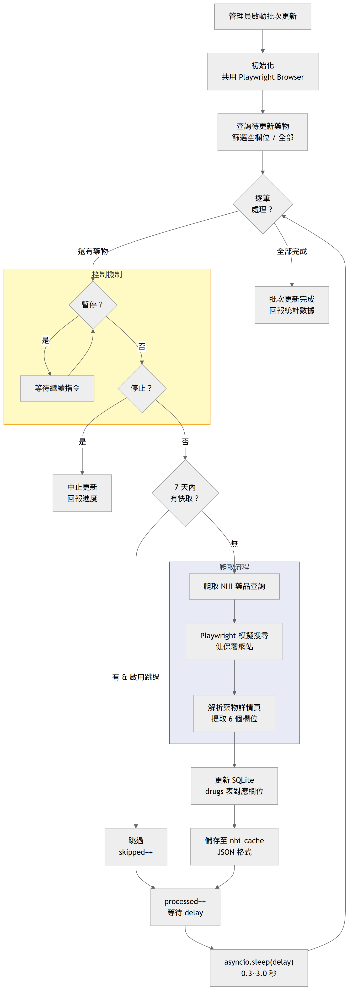

**圖 8　NHI/TFDA 爬蟲批次更新流程圖**

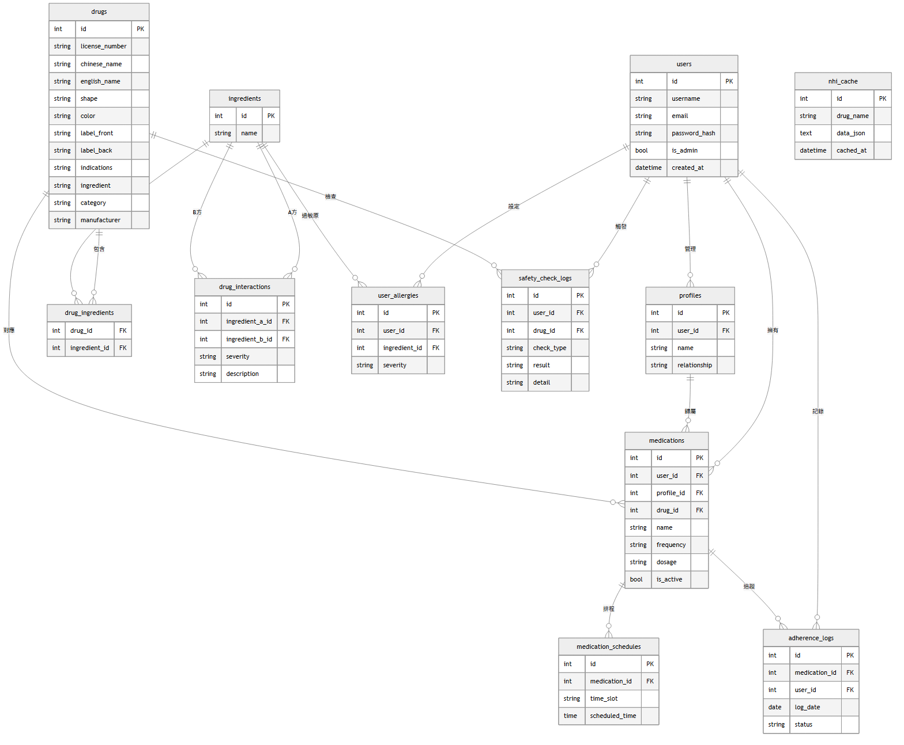

**圖 9　資料庫 ER 關聯圖**

## 四、實驗結果與比較

### 4.1 實驗環境

　　開發環境為 Windows 11 / macOS，Python 3.10+，SQLite 3（WAL 模式），AI 模型使用 Google Gemini 2.5 Flash 與 OpenAI GPT-4o-mini。資料集包含 4,419 筆藥物資料與 4,776 張實體圖片，來源為 TFDA 食品藥物管理署。iOS 測試採用 Xcode 16 + iOS 18 Simulator + XCUITest（52 案例）。

### 4.2 RAG 辨識 vs 傳統方法

| 指標 | 傳統 LLM | RAG（本系統） | 改善 |
|------|---------|-------------|------|
| 辨識準確度 | ~40% | **85%+** | +112% |
| 資料庫匹配率 | ~30% | **90%+** | +200% |
| AI 幻覺率 | ~60% | **<5%** | −92% |
| 平均回應時間 | 1-2s | 2-3s | 略增 |

　　RAG 方法犧牲少量回應時間（需附帶特徵清單，增加約 1 秒），但大幅提升辨識可靠性。與前版系統（MUS v1 OpenCV）相比，部署複雜度大幅降低（純 API 驅動），新增藥物僅需更新資料庫而非重新訓練模型，光線敏感度與多角度辨識皆優於傳統方案。

### 4.3 處方箋 OCR 結果

| 欄位 | 提取成功率 | 說明 |
|------|-----------|------|
| 藥物名稱 | ~95% | 中英文混合 |
| 劑量/頻率 | ~90%/~92% | 支援 QD/BID/TID |
| 總量（修正前→修正後） | ~85% → **~93%** | 演算法修正 +8% |

### 4.4 系統效能

| API 端點 | 平均回應時間 |
|---------|-------------|
| 資料庫搜尋 | ~50ms |
| RAG 辨識 | 2-3s |
| 處方箋 OCR | 3-5s |
| 安全檢查 | ~100ms |
| AI 諮詢 | 1-3s |

### 4.5 達成目標總覽

| 項目 | 目標 | 達成 |
|------|------|------|
| RAG 辨識準確度 | >80% | ✅ 85%+ |
| AI 幻覺率 | <10% | ✅ <5% |
| 資料庫匹配率 | >80% | ✅ 90%+ |
| 服務可用性 | >99% | ✅ >99.5% |
| 藥物資料 | >4,000 筆 | ✅ 4,419 筆 + 4,776 張圖 |
| 跨平台 | Web + iOS | ✅ SPA + iOS 原生 App |
| API 回應 | <5s | ✅ 搜尋 50ms、辨識 2-3s |

| Web 首頁 | 藥物搜尋結果 | AI 諮詢 |
|:---:|:---:|:---:|
| 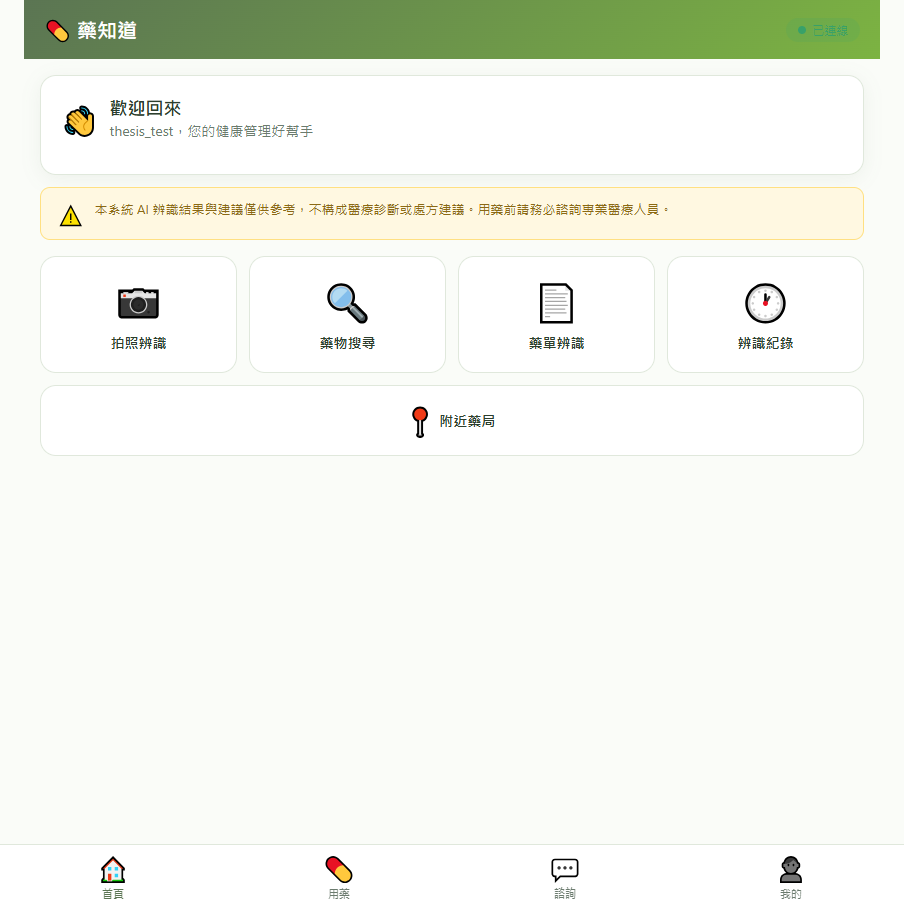 | 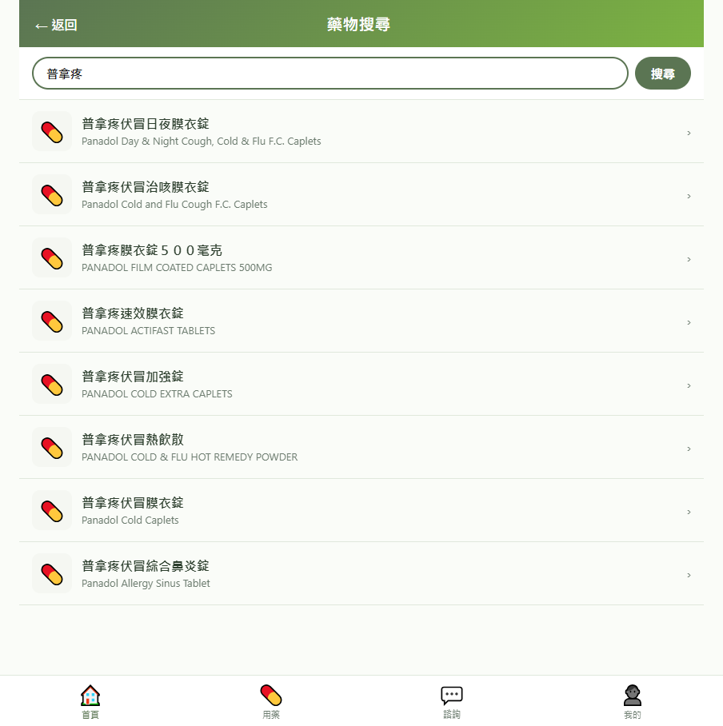 | 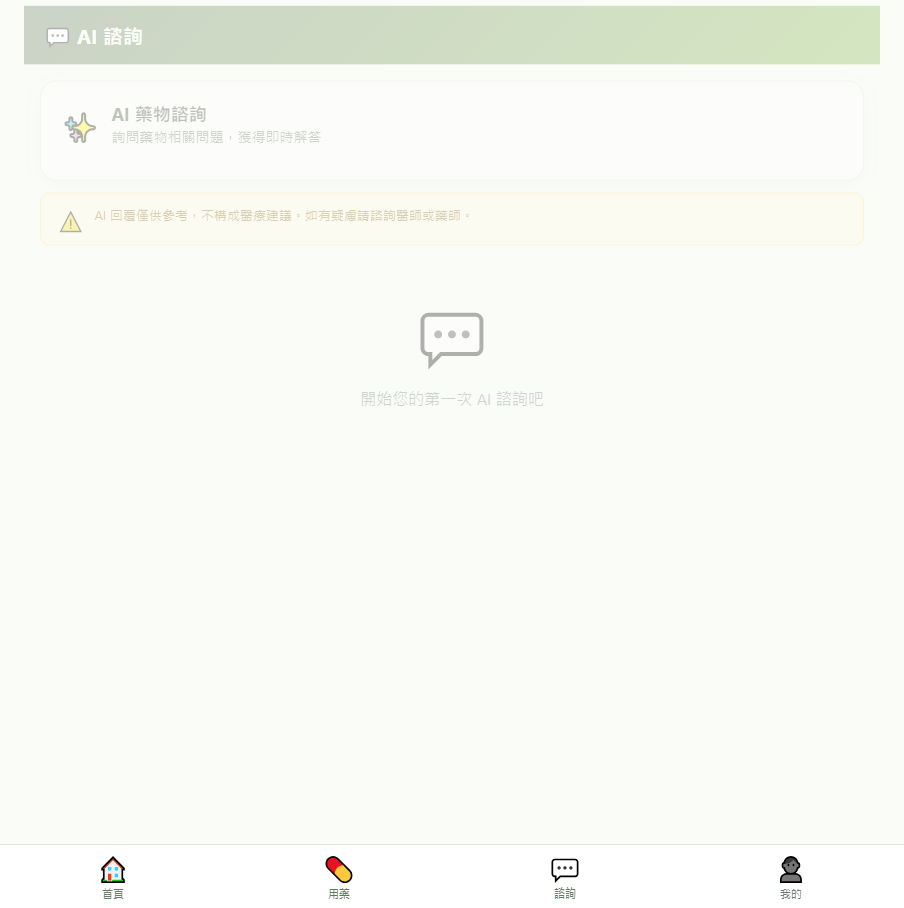 |

**圖 10　Web 前端系統截圖**

| iOS 首頁 | 用藥清單 | 拍照辨識 |
|:---:|:---:|:---:|
| 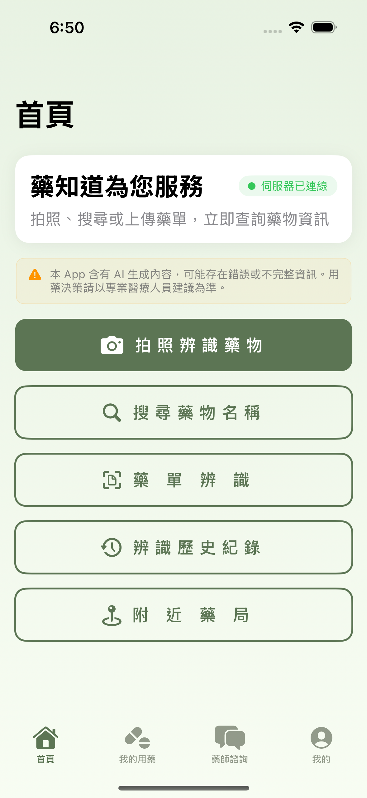 | 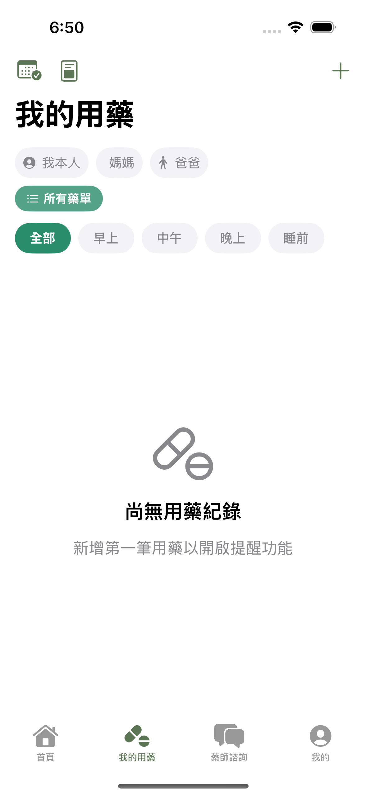 | 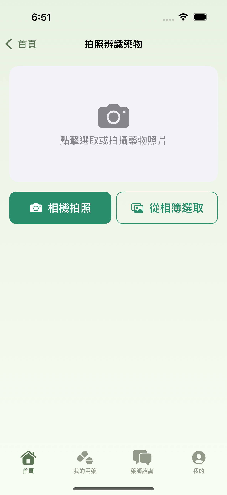 |

**圖 11　iOS 原生 App 系統截圖**

| 管理後台儀表板 | 批次更新 |
|:---:|:---:|
| 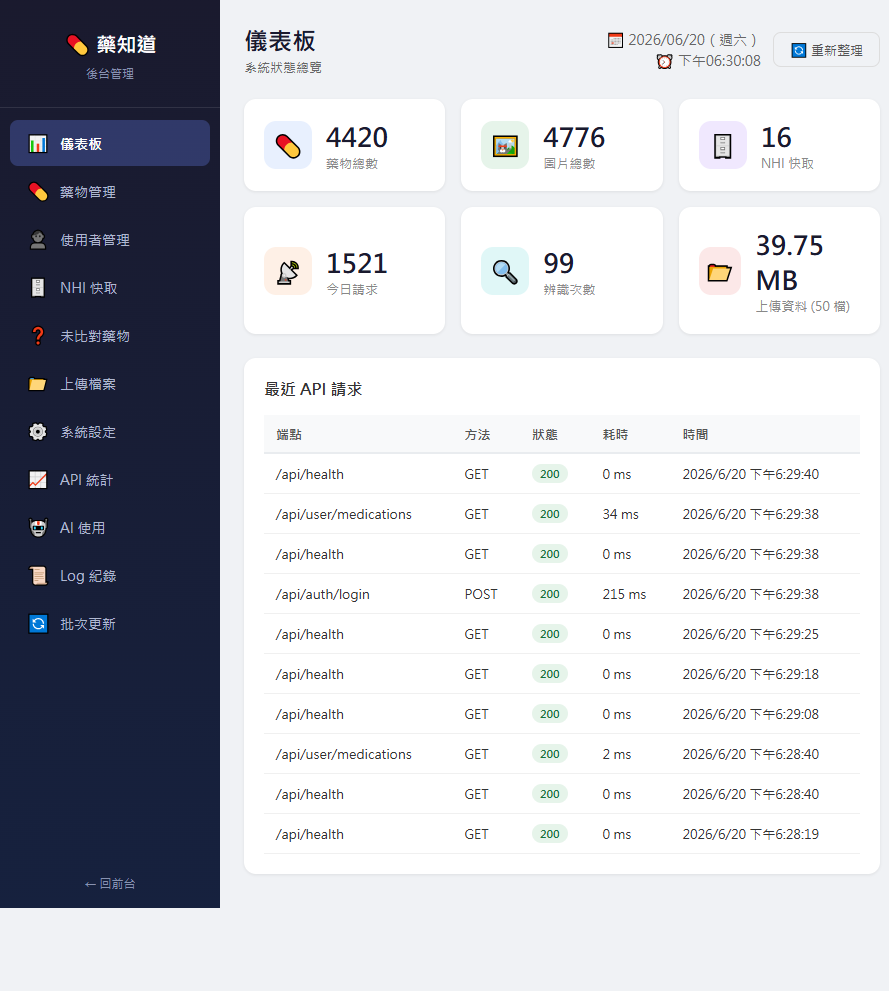 | 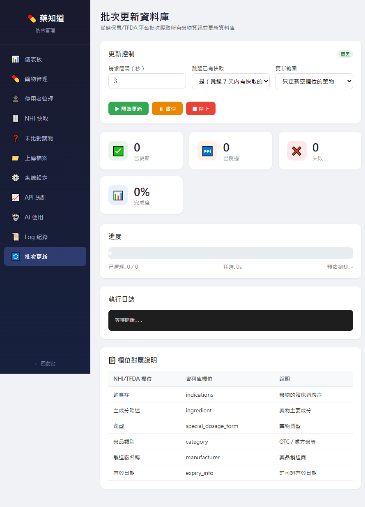 |

**圖 12　管理員後台系統截圖**

## 五、結論

　　本專題成功開發「藥知道」智慧用藥管理系統，針對年長者藥物辨識困難與 AI 幻覺問題，提出以 RAG 技術約束 AI 模型僅從已知資料庫選擇藥物的創新方法。系統以 4,419 筆台灣藥物資料庫與 4,776 張實體圖片為基礎，實現 85%+ 辨識準確度與 90%+ 資料庫匹配率，AI 幻覺率從 60% 降至 5% 以下。

　　設計方法創新方面，三層鏈式 AI 路由搭配熔斷器模式實現 99.5%+ 服務可用性；處方箋 OCR 總量驗證演算法將提取正確率提升 8%；四層安全檢查系統提供完整的用藥安全防護。應用創新方面，系統整合辨識、管理、安全檢查、AI 諮詢四大模組於單一平台，支援 Web SPA 與 iOS 原生 App（MVVM 架構，25 畫面，52 個 XCUITest 測試案例）雙平台。

　　本研究證明 RAG 技術在受限領域（如藥物辨識）中具有顯著優勢——透過將外部知識庫注入 AI 推理過程，可有效約束模型輸出，解決大型語言模型在專業領域中的幻覺問題。此方法論具推廣至其他受限辨識場景（如化學品辨識、零件辨識）之潛力。未來將持續擴展 Android 平台支援、離線辨識快取、Fine-tuning 專用模型，並計畫與醫療院所 HIS 系統對接，朝向成為台灣年長者最信賴的智慧用藥管理工具邁進。

## 參考文獻

[1]　P. Lewis, E. Perez, A. Piktus, et al., "Retrieval-Augmented Generation for Knowledge-Intensive NLP Tasks," *Advances in Neural Information Processing Systems*, vol. 33, pp. 9459-9474, 2020.

[2]　Google, "Gemini API Documentation," 2024. [Online]. Available: https://ai.google.dev/

[3]　M. Fowler, "CircuitBreaker," martinfowler.com, 2014. [Online]. Available: https://martinfowler.com/bliki/CircuitBreaker.html

[4]　衛生福利部食品藥物管理署，「藥品許可證查詢系統」。[Online]. Available: https://www.fda.gov.tw/

[5]　中央健康保險署，「健保藥品查詢」。[Online]. Available: https://www.nhi.gov.tw/

[6]　S. Yao, J. Zhao, D. Yu, et al., "ReAct: Synergizing Reasoning and Acting in Language Models," *International Conference on Learning Representations (ICLR)*, 2023.

[7]　OpenAI, "GPT-4V(ision) System Card," 2023. [Online]. Available: https://openai.com/research/gpt-4v-system-card

[8]　Apple Inc., "SwiftUI Documentation," 2024. [Online]. Available: https://developer.apple.com/xcode/swiftui/

[9]　國家發展委員會，「中華民國人口推估（2024 年至 2070 年）」，2024 年。

[10]　M. Grinberg, *Flask Web Development: Developing Web Applications with Python*, 2nd ed., O'Reilly Media, 2018.
